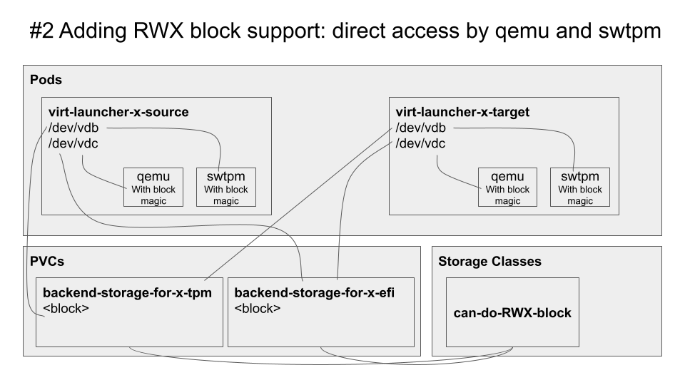

# Overview
This proposal is about supporting the migration of all VMs that use a persistent feature, such as persistent vTPM.

To make this document as simple as possible, let's consider that storage in Kubernetes can either be filesystem (FS) or
block mode, and either ReadWriteOnce (RWO) or ReadWriteMany (RWX) access mode, with storage classes supporting any
number of combinations of both.

As of KubeVirt 1.3, Here is how each of the 4 combinations is supported by the backend-storage for persistent VM state:
- RWO FS: supported by backend-storage but makes VMs non-migratable. **This entire design proposal is about removing that limitation.**
- RWX FS: preferred combination, supported by backend-storage and compatible with VM migrations
- RWO block: not supported yet, but PRs exist to implement it in a non-migratable way 
- RWX block: same as above, with migratability functional but considered unsafe, because it leads to 2 pods (source and target virt-launchers) mounting the same ext3 filesystem concurrently.

The above is the best we can do with the current implementation, which involves mounting the same partition on migration source and target.  
This proposal is about switching to a different model which would instead create a new backend-storage PVC on migration, enabling RWO FS.  

Furthermore, the implementation of this design proposal would also allow a potential block-based implementation, compatible with both RWO and RWX and safely migratable.  
That, however, is out-of-scope for this design proposal, and may never be needed, since most/all block storage classes also support RWO FS.

## Alternative approach
The alternative to this design is for upstream components (libvirt - qemu - swtpm) to add block storage support for TPM/EFI.  
KubeVirt could then create one backend-storage PVC per feature (EFI/TPM) and pass them directly to libvirt.  
That alternative approach would enable RWX block backend-storage (as opposed to RWO FS in this proposal).  

Pros:
- Less code to write and maintain in KubeVirt
- No need to duplicate backend-storage PVCs on migrations and delete the correct one after migration success/failure
- Libvirt gains a feature

Cons:
- Relies on third party projects adding and maintaining options to store config files into a block devices without filesystems
- Requires one PVC per feature for every VM

## Motivation/Goals
- Users want to be able to use any storage class for backend-storage
- Users want all VMs with persistent features to be potentially migratable

## Definition of Users
Any VM owner that wants to use persistent features, such as TPM or EFI

## User Stories
As a user, I want to be able to seamlessly enable persistent features while keeping the migratability of my VMs.

## Repos
kubevirt/kubevirt

# Design
- When creating a new VM with persistent features, we use either (first match wins):
  - The storage class specified in the KubeVirt Custom Resource
  - The storage class marked as the default for virtualization purposes unless it has a StorageProfile that shows only block is supported
  - The storage class marked as the default for the cluster
- All new persistent storage PVCs will be created with the name `persistent-state-for-<vm_name>-<random_string>` and the new annotation `persistent-state-for-<vm_name>=true`
- When starting an existing VM with persistent features, we will look for any PVC with the annotation, or any PVC with the legacy name, for backwards compatibility
- The volume mode will be Filesystem
- The access mode will be RWO, unless a StorageProfile exists for the Storage Class and shows only RWX is supported
  - Note: the CR field documentation will be adjusted to reflect that RWX is not longer needed
- When a migration is created:
  - We create a new empty PVC for the target, with the name `persistent-state-for-<vm_name>-<random_string>` and no annotation
  - In the migration object status, we store the names of both the source and target PVCs (see API section below)
  - If a migration succeeds, we set the annotation `persistent-state-for-<vm_name>=true` on the new (target) PVC and delete the old (source) PVC, using the source PVC name from the migration object
  - If a migration fails, we delete the target backend-storage PVC that was just created, using the target PVC name from the migration object
  - In the unlikely event that a VM shuts down towards the very end of a migration, the migration finalizer will decide which PVC to keep and which one to get rid of
    - **Important note**: with the way the migration controller currently works, this has the potential of suffering a race condition. We need to make absolutely sure that won't happen.

## API
The only API that's introduced is a couple status fields in the VirtualMachineMigration object:
- `SourcePersistentStatePVCName`
- `TargetPersistentStatePVCName`

## Scalability
No new scalability concern will be introduced.

## Update/Rollback Compatibility
Since the name of the backend-storage PVC will change, we will keep fallback code to look for the legacy PVC.

## Functional Testing Approach
All existing backend-storage-related functional tests will still apply. More tests could be added to ensure all 4 combinations
of FS/block RWX/RWO work for backend-storage, if we think it's worth the additional stress on the e2e test lanes. 

# Implementation Phases
First phase is block support. That effort is well underway already.  
Second phase is changing the PVC handling and could be done as part of the first phase PR or as a separate one.  
Either way, it's important that both phases land in the same KubeVirt release.

# Diagrams
Below are (very) rough diagrams to illustrate this proposal:
## Current solution

## Proposed solution (this design proposal)

## Alternative solution (see [above](#alternative-approach))
